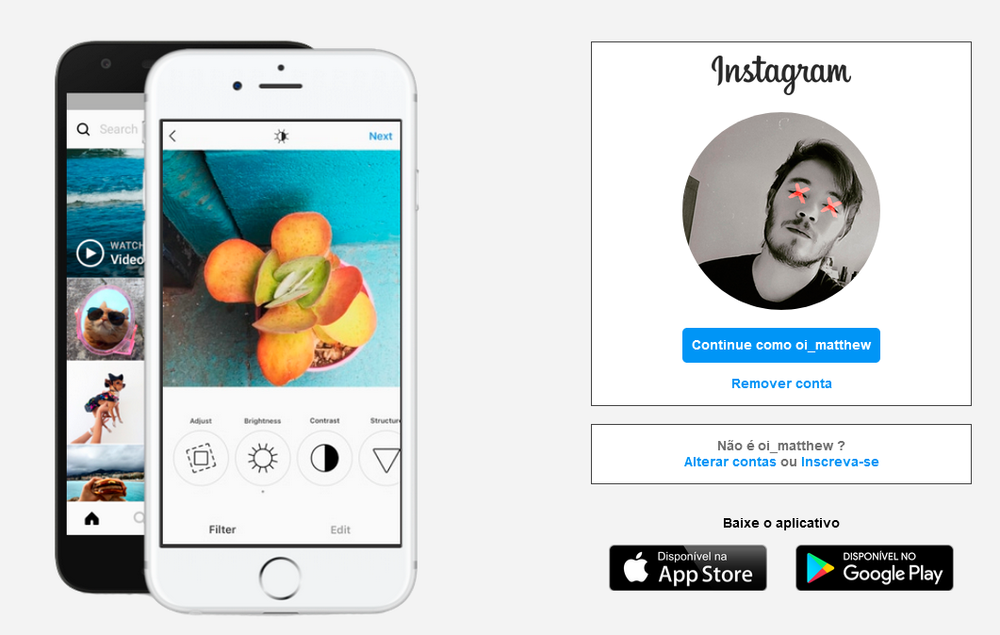

# UI Clone - Instagram

> Personal Project to study | UI Clone Instagram.

# :pushpin: Table of Contents

- [Features](#rocket-features)
- [UI Documentation](#framed_picture-ui-documentation)
- [Installation](#construction_worker-installation)
- [Getting Started](#runner-getting-started)
- [FAQ](#postbox-faq)
- [Found a bug? Missing a specific feature?](#bug-issues)
- [Contributing](#tada-contributing)
- [License](#closed_book-license)

 

# :rocket: Features

- Only HTML, CSS and Javascript
- JS Logic

# :framed_picture: UI Documentation

This project has a UI Documentation of reusable components, allowing to test them individually.

   

# :construction_worker: Installation

**No need any dependencies**

`git clone https://github.com/matheus13f/Recriando_Interface_Instagram.git`

SSH URLs provide access to a Git repository via SSH, a secure protocol. If you have a SSH key registered in your Github account, clone the project using this command:

`git clone git@github.com:matheus13f/Recriando_Interface_Instagram.git`

# :runner: Getting Started

Use the following command to start the application in a development environment:

`open the index.html file in your browser`

# :postbox: Faq

**Question:** What are the technologies used in this project?

**Answer:** HTML, CSS and Javascript Vanilla

# :bug: Issues

Feel free to **file a new issue** with a respective title and description on the [UI Clone Instagram](https://github.com/matheus13f/Recriando_Interface_Instagram/issues) repository. If you already found a solution to your problem, **i would love to review your pull request**! Have a look at our [contribution guidelines](https://github.com/matheus13f/Recriando_Interface_Instagram/blob/master/CONTRIBUTING.md) to find out about the coding standards.

# :tada: Contributing

Check out the [contributing](https://github.com/matheus13f/Workout_NextJs/blob/master/CONTRIBUTING.md) page to see the best places to file issues, start discussions and begin contributing.

# :closed_book: License

Released in 2020.
This project is under the [MIT license](https://github.com/matheus13f/Recriando_Interface_Instagram/master/LICENSE).
